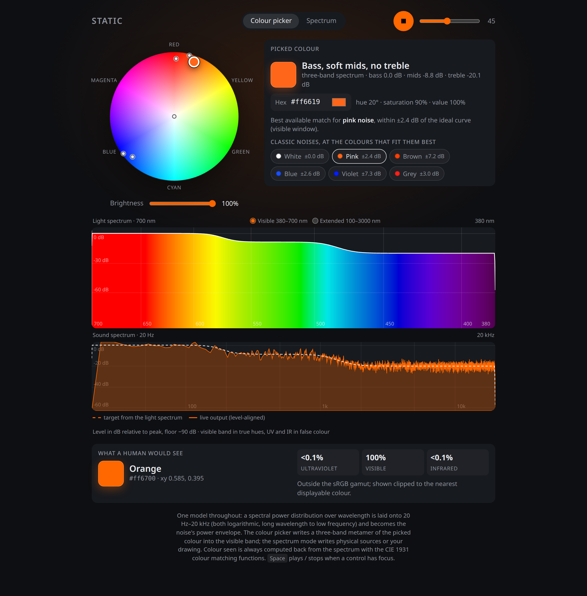
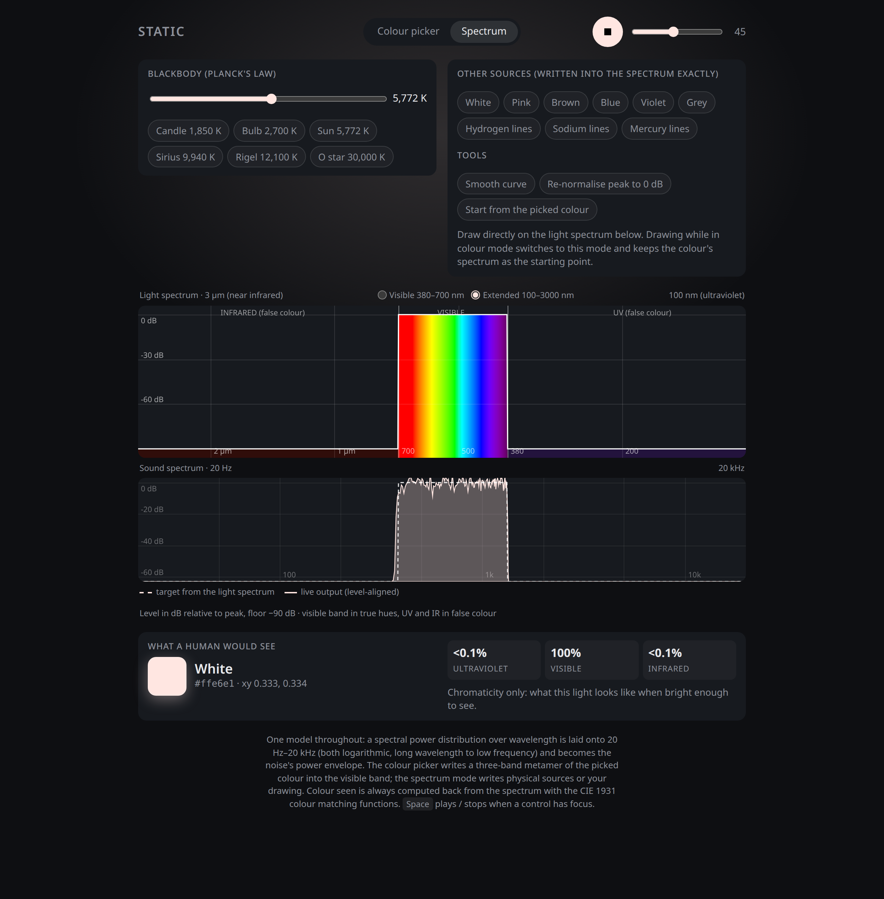
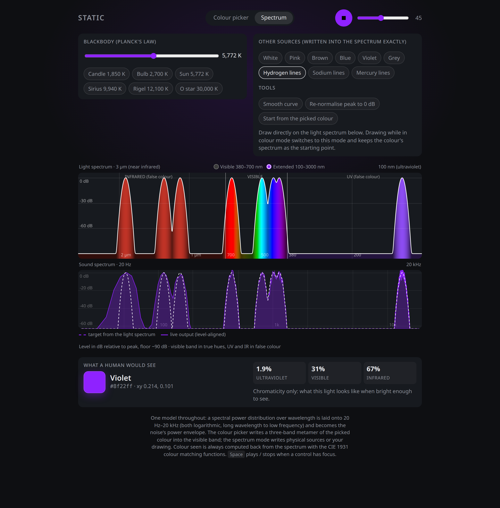

# Static

A single-file, dependency-free noise generator that turns light into sound.

**Try it:** https://silentoplayz.github.io/static-noise/

Or open `index.html` in any modern browser. Nothing to install, nothing fetched.

## Features

* Stereo noise rendered off the main thread in a Web Worker, so dragging never stutters.
* Sleep timer with a gentle fade (15 to 90 minutes).
* Share links: the address bar always holds a link that reopens exactly this sound,
  including a hand-drawn spectrum.
* Download one minute of 48 kHz stereo WAV, tiled from the seamless loop.
* Installable as an app and works offline (web app manifest plus service worker).
* Lock-screen and media-key controls through the Media Session API.
* No network requests, no analytics, no accounts.

## The model

One spectrum drives everything: a spectral power distribution (SPD) over
wavelength, stored in dB relative to its peak, sampled uniformly in log
wavelength from 100 nm to 3000 nm.

* **Sound.** A wavelength window is laid onto the audible range (20 Hz to
  20 kHz), both logarithmic, long wavelength to low frequency. The SPD becomes
  the noise's power envelope. The noise itself is synthesised in the frequency
  domain with fixed random phases and an inverse FFT, so the loop is seamless
  and moving between spectra crossfades the same texture rather than jumping to
  a new random one.
* **Colour seen.** The SPD is integrated against the CIE 1931 colour matching
  functions (Wyman, Sloan and Shirley's 2013 analytic fit) and converted to
  sRGB. The swatch shows chromaticity only. Out-of-gamut results are flagged as
  clipped; a spectrum with no visible power is reported as invisible.

Two windows are offered. **Visible** (380 to 700 nm) spreads the visible band
over the whole audible range and is the default for the colour picker.
**Extended** (100 to 3000 nm) covers near-ultraviolet to near-infrared and is
the default for the spectrum mode. The mapping is a convention: visible light
spans one octave, hearing spans ten.

## Input modes

**Colour picker.** A hue and saturation disc with a brightness slider, hex
field and system colour picker. A picked colour is linearised to radiometric
RGB and written into the visible band as a three-band metamer: three smooth
bands for long, medium and short wavelengths that sum to exactly one, so white
gives a perfectly flat spectrum, red gives bass only, magenta gives bass plus
treble with the mids cut. Brightness scales level; black is silence. The
classic noise colours are shown as reference dots at the colours whose spectra
fit them best, with the fit error stated. A three-band spectrum cannot make a
60 dB tilt, so brown and violet are only approximated, and the page says so.

**Spectrum.** Draw the SPD directly, or fill it from a source:

* blackbody radiation from Planck's law, 1,000 to 30,000 K, with the Wien
  peak reported (candle, bulb, Sun, Sirius, Rigel and a 30,000 K O star as
  presets);
* the classic noises, exact, since a straight slope is directly representable;
* hydrogen, sodium and mercury emission lines at their standard wavelengths.
  Each line becomes a band of noise about a semitone wide. Relative line
  intensities are not modelled and are set equal.

Drawing on the spectrum while in colour mode switches to spectrum mode and
keeps the colour's spectrum as the starting point.

## Notes on correctness

* A flat spectrum renders as `#ffe6e1`, not pure white. Equal-energy white
  (Illuminant E) is slightly warmer than the D65 white that sRGB treats as
  neutral.
* The colour seen for a picked colour can differ from the picked colour. Broad
  bands cannot reproduce saturated display primaries. The spectrum, not the
  swatch, is what plays.
* The synthesis band-limits the envelope to 20 kHz and rolls off below 20 Hz,
  so high-sample-rate devices do not dump energy into the ultrasonic range.

## Layout

* `index.html` — the app.
* `manifest.webmanifest`, `sw.js` — installable, offline-capable shell.
* `assets/` — icons, social card and screenshots.
* `archive/colour-first.html` — earlier colour-picker-only version.
* `archive/spectrum-first.html` — earlier spectrum-only version.
